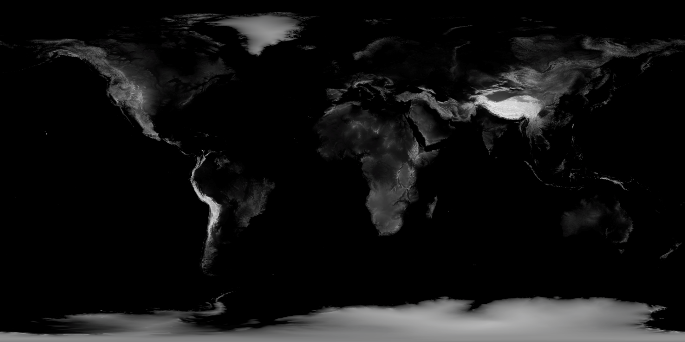
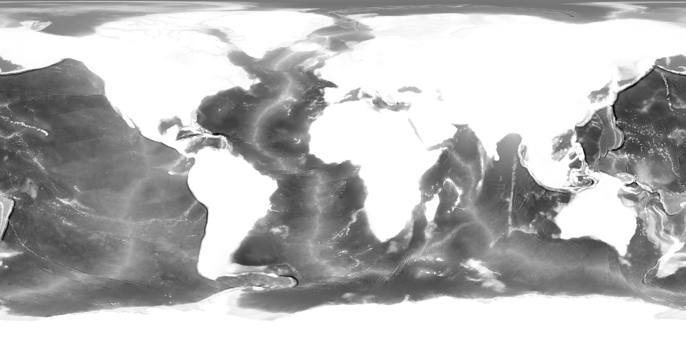

# Data World

Earth's topography mapped to dots in 3D space by superimposing images of land and sea elevation.

### [Click here to generate it in your browser.](http://ricedust.com/p5-data-world/)

## How It Works

I began with two black and white images, courtesy of NASA. The first image captures land elevation and the second captures sea elevation:

For land data, the lighter the pixel, the higher the elevation, where pure white represents a max elevation of 6400 meters. For sea data, the darker the pixel, the greater the depth, where pure black is a max depth of 8000 meters. 

I mapped the grayscale value (0 to 255) of land pixels to a height (0 to 6400 meters) and mapped the grayscale value of sea pixels to a depth (-8000 to 0 meters). I obtain an array of height mappings I can use to draw points in 3D space by combining the calculated depth values of each pixel.
